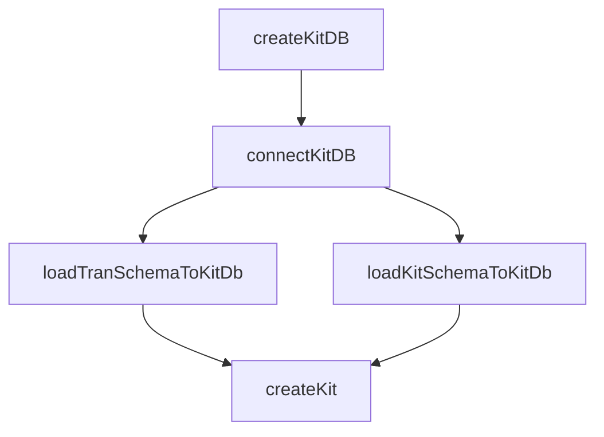

# Overview

adetran is an open-source version of the <SwmToken path="adetran/build.gradle" pos="5:6:6" line-data="    id &#39;progress.openedge.abl-base&#39; version &#39;1.0.0&#39;">`openedge`</SwmToken> Translation Manager and Visual Translator. It is released under the Apache 2.0 license and is not supported by Progress Software. The package includes both the <SwmToken path="adetran/build.gradle" pos="5:6:6" line-data="    id &#39;progress.openedge.abl-base&#39; version &#39;1.0.0&#39;">`openedge`</SwmToken> Translation Manager and the Visual Translator Tool. Users are free to clone the repository, but pull requests will likely be rejected or ignored.

# Building adetran

To build adetran, use the command `./gradlew `<SwmToken path="adetran/build.gradle" pos="240:2:2" line-data="task build {">`build`</SwmToken>. The output will be located in the build directory, including the primary build output `build/tranman.pl` and `build/resources` folder.

# Running adetran

After building, you can run the Visual Translator tool or the Translation Manager application using prowin. Configure the PROPATH to include both the `build/tranman.pl` and `build/resources` folder. Launch scripts are provided to assist with this setup.

# Help and Documentation

For help and instructions, visit the Progress documentation website. Note that Translation Manager and Visual Translator are not distributed with <SwmToken path="adetran/build.gradle" pos="5:6:6" line-data="    id &#39;progress.openedge.abl-base&#39; version &#39;1.0.0&#39;">`openedge`</SwmToken> 12, so you may need to refer to the <SwmToken path="adetran/build.gradle" pos="5:6:6" line-data="    id &#39;progress.openedge.abl-base&#39; version &#39;1.0.0&#39;">`openedge`</SwmToken> 11 help content.

# adetran Endpoints

adetran provides several tasks for managing the translation database. Below are the key tasks and their descriptions.

## <SwmToken path="adetran/build.gradle" pos="72:2:2" line-data="task createKitDB(type: CreateDB) {">`createKitDB`</SwmToken>

The <SwmToken path="adetran/build.gradle" pos="72:2:2" line-data="task createKitDB(type: CreateDB) {">`createKitDB`</SwmToken> task is responsible for creating the <SwmToken path="adetran/build.gradle" pos="73:6:6" line-data="    dbName = &quot;xlkit&quot;">`xlkit`</SwmToken> database. It specifies the database name, block size, and output directory. The task ensures the directory exists before creating the database and converts the code page after creation.

<SwmSnippet path="/adetran/build.gradle" line="72">

---

The <SwmToken path="adetran/build.gradle" pos="72:2:2" line-data="task createKitDB(type: CreateDB) {">`createKitDB`</SwmToken> task in the <SwmPath>[adetran/build.gradle](adetran/build.gradle)</SwmPath> file defines the creation process of the <SwmToken path="adetran/build.gradle" pos="73:6:6" line-data="    dbName = &quot;xlkit&quot;">`xlkit`</SwmToken> database.

```gradle
task createKitDB(type: CreateDB) {
    dbName = "xlkit"
    blockSize = 8
    outputDir = "${dbdir}" 

    doFirst {
        mkdir "${dbdir}"
    }

    doLast {
        convertCodePage (xlkitdb)
    }
}
```

---

</SwmSnippet>

## <SwmToken path="adetran/build.gradle" pos="89:2:2" line-data="task connectKitDB(type: DBConnection) {">`connectKitDB`</SwmToken>

The <SwmToken path="adetran/build.gradle" pos="89:2:2" line-data="task connectKitDB(type: DBConnection) {">`connectKitDB`</SwmToken> task defines the connection to the <SwmToken path="adetran/build.gradle" pos="73:6:6" line-data="    dbName = &quot;xlkit&quot;">`xlkit`</SwmToken> database. It sets the database name, connection parameters, and an identifier for the connection. The task ensures the directory exists before establishing the connection.

<SwmSnippet path="/adetran/build.gradle" line="89">

---

The <SwmToken path="adetran/build.gradle" pos="89:2:2" line-data="task connectKitDB(type: DBConnection) {">`connectKitDB`</SwmToken> task in the <SwmPath>[adetran/build.gradle](adetran/build.gradle)</SwmPath> file defines the connection parameters for the <SwmToken path="adetran/build.gradle" pos="90:11:11" line-data="    dbName = &quot;${dbdir}/xlkit&quot;">`xlkit`</SwmToken> database.

```gradle
task connectKitDB(type: DBConnection) {
    dbName = "${dbdir}/xlkit"
    connectionParameters = "-1 -ld kit"
    id = 'xlkit'
    doFirst {
        mkdir "${dbdir}"
    }
}
```

---

</SwmSnippet>



&nbsp;

*This is an auto-generated document by Swimm 🌊 and has not yet been verified by a human*

<SwmMeta version="3.0.0" repo-id="Z2l0aHViJTNBJTNBT3BlbkVkZ2VfUmV0aXJlZF9Qcm9kdWN0cyUzQSUzQVBBUFA5Mg==" repo-name="OpenEdge_Retired_Products"><sup>Powered by [Swimm](/)</sup></SwmMeta>
