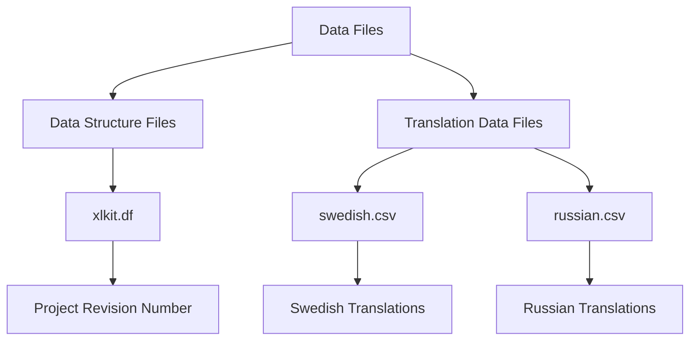

# Getting Started with Data Files

This document provides an overview of the data files used in the `adetran` directory, including their structure and purpose. These files are essential for defining database structures and managing translations.

# Data Structure Files

The <SwmPath>[adetran/data/xlkit.df](adetran/data/xlkit.df)</SwmPath> file defines the structure of several tables related to projects, glossaries, procedures, and instances. This includes fields and indexes that are crucial for the database schema.

# Translation Data Files

CSV files such as <SwmPath>[adetran/data/swedish.csv](adetran/data/swedish.csv)</SwmPath> and <SwmPath>[adetran/data/russian.csv](adetran/data/russian.csv)</SwmPath> contain translation data for different languages. These files are used to manage and apply translations across various parts of the application.

<SwmSnippet path="/adetran/data/_tran.df" line="1">

---

The <SwmPath>[adetran/data/\_tran.df](adetran/data/_tran.df)</SwmPath> file contains definitions for collation and translation tables, specifying how characters are sorted and translated.

```df
UPDATE DATABASE "?"
```

---

</SwmSnippet>



&nbsp;

*This is an auto-generated document by Swimm 🌊 and has not yet been verified by a human*

<SwmMeta version="3.0.0" repo-id="Z2l0aHViJTNBJTNBT3BlbkVkZ2VfUmV0aXJlZF9Qcm9kdWN0cyUzQSUzQVBBUFA5Mg==" repo-name="OpenEdge_Retired_Products"><sup>Powered by [Swimm](/)</sup></SwmMeta>
