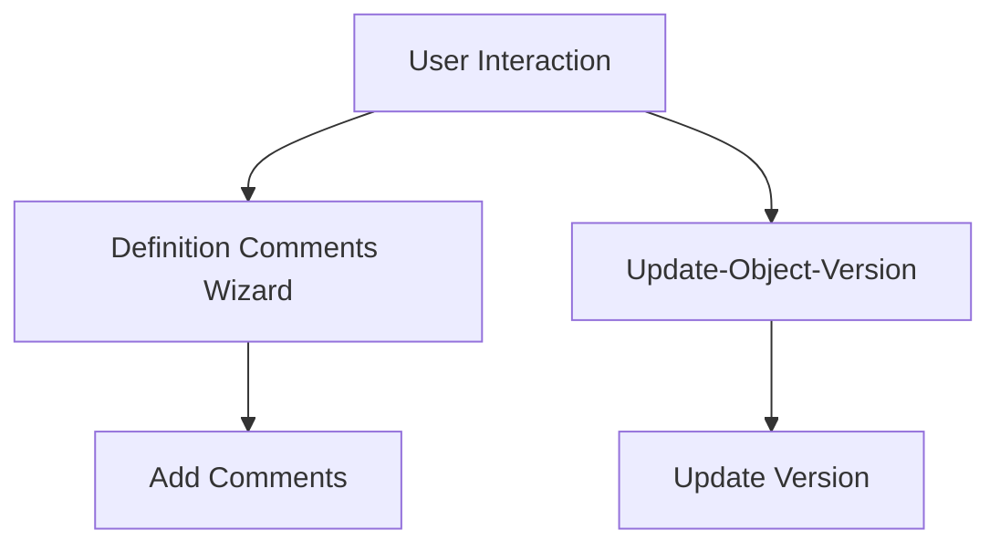

# Getting Started with User Interface in Dynamics

The User Interface (UI) in Dynamics is responsible for rendering and managing the visual elements that users interact with. It includes various components such as windows, menus, toolbars, and control elements.

## UI Components

The UI components are defined using XML and ABL (Advanced Business Language) code, which specify the layout, behavior, and interactions of the visual elements. These components are organized into smart objects, which are reusable UI elements that can be linked together to form complex interfaces.

## Attributes of UI Components

Each UI component, such as a menu or toolbar, is described in detail within its respective file, including attributes like layout position, instance name, and description. These attributes help in defining the structure and functionality of the UI elements.

## Event Controls and Triggers

The UI also includes event controls and triggers that handle user interactions, such as button clicks or window closures. These controls ensure that the UI responds appropriately to user actions, providing a seamless and interactive experience.

## User Interface Endpoints

User Interface Endpoints are specific points in the UI where certain actions or processes are initiated. These endpoints help in managing and organizing the various functionalities within the UI.

<SwmSnippet path="/dynamics/src/main/abl/ry/uib/rydyncontw.w" line="26">

---

### Definition Comments Wizard

The <SwmToken path="dynamics/src/main/abl/ry/uib/rydyncontw.w" pos="26:14:18" line-data="&amp;ANALYZE-SUSPEND _UIB-CODE-BLOCK _XFTR &quot;Definition Comments Wizard&quot; wWin _INLINE">`Definition Comments Wizard`</SwmToken> endpoint is responsible for guiding the user through the process of adding comments to program definitions. It includes actions and instructions for the user, ensuring that comments are added correctly.

```c
&ANALYZE-SUSPEND _UIB-CODE-BLOCK _XFTR "Definition Comments Wizard" wWin _INLINE
/* Actions: ? af/cod/aftemwizcw.w ? ? ? */
/* Program Definition Comment Block Wizard
Welcome to the Program Definition Comment Block Wizard. Press Next to proceed.
af/cod/aftemwizpw.w
*/
/* _UIB-CODE-BLOCK-END */
&ANALYZE-RESUME
```

---

</SwmSnippet>

<SwmSnippet path="/dynamics/src/main/abl/ry/uib/rydyncontw.w" line="18">

---

### <SwmToken path="dynamics/src/main/abl/ry/uib/rydyncontw.w" pos="18:14:18" line-data="&amp;ANALYZE-SUSPEND _UIB-CODE-BLOCK _XFTR &quot;Update-Object-Version&quot; wWin _INLINE">`Update-Object-Version`</SwmToken>

The <SwmToken path="dynamics/src/main/abl/ry/uib/rydyncontw.w" pos="18:14:18" line-data="&amp;ANALYZE-SUSPEND _UIB-CODE-BLOCK _XFTR &quot;Update-Object-Version&quot; wWin _INLINE">`Update-Object-Version`</SwmToken> endpoint handles the process of updating the version of an object. This is crucial for maintaining version control and ensuring that the latest updates are applied to the object.

```c
&ANALYZE-SUSPEND _UIB-CODE-BLOCK _XFTR "Update-Object-Version" wWin _INLINE
/* Actions: ? ? ? ? af/sup/afverxftrp.p */
/* This has to go above the definitions sections, as that is what it modifies.
   If its not, then the definitions section will have been saved before the
   XFTR code kicks in and changes it */
/* _UIB-CODE-BLOCK-END */
```

---

</SwmSnippet>



&nbsp;

*This is an auto-generated document by Swimm 🌊 and has not yet been verified by a human*

<SwmMeta version="3.0.0" repo-id="Z2l0aHViJTNBJTNBT3BlbkVkZ2VfUmV0aXJlZF9Qcm9kdWN0cyUzQSUzQVBBUFA5Mg==" repo-name="OpenEdge_Retired_Products"><sup>Powered by [Swimm](/)</sup></SwmMeta>
