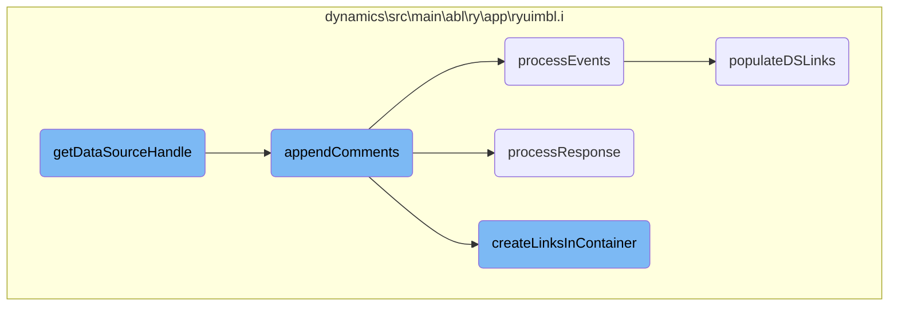
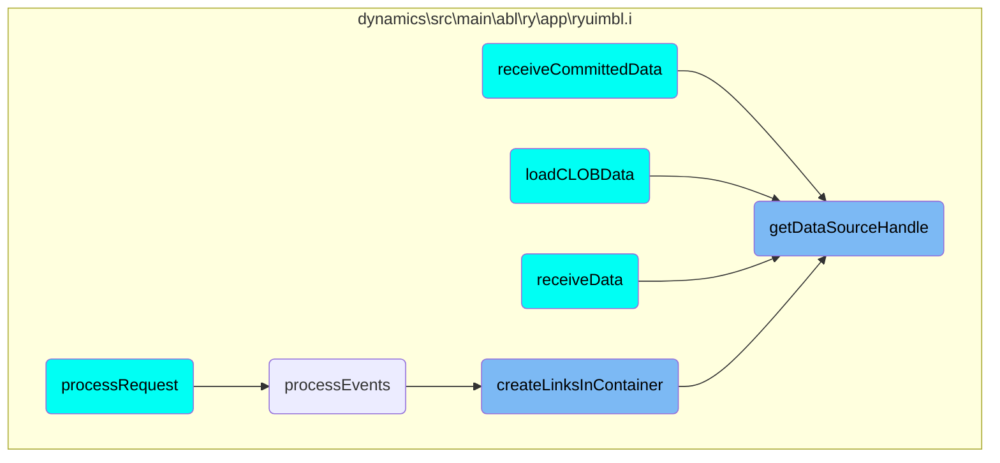

This document explains the process of handling data sources, including determining if the data source is a Smart Business Object (SBO) or a Standard Data Object (SDO), managing the context for the data source, and handling the initialization and retrieval of data source handles.

The flow starts by checking if the data source is an SBO or SDO. If it is an SBO or has multiple entries, it assigns the SBO and SDO names. Next, it manages the context for the data source by retrieving and saving the data source path and context. If the SDO has not been instantiated, it starts the container and sets up the context. Finally, if the data source is an SBO and has an SDO name, it finds the SDO handle within the SBO and initializes entity details; otherwise, it returns the data source handle directly.

# Flow drill down



<SwmSnippet path="/dynamics/src/main/abl/ry/app/ryuimbl.i" line="3263">

---

## Determining if the Data Source is an SBO

The function first checks if the data source (DS) to be started is an SBO by calling <SwmToken path="dynamics/src/main/abl/ry/app/ryuimbl.i" pos="3264:7:7" line-data="  ASSIGN cDSIsSBO = getSavedDSProperty(pcLogicalObjectName, pcDSName, &#39;isSBO&#39;:U)">`getSavedDSProperty`</SwmToken> with the property <SwmToken path="dynamics/src/main/abl/ry/app/ryuimbl.i" pos="3264:16:16" line-data="  ASSIGN cDSIsSBO = getSavedDSProperty(pcLogicalObjectName, pcDSName, &#39;isSBO&#39;:U)">`isSBO`</SwmToken>. This determines if the DS is a Smart Business Object (SBO) or a Standard Data Object (SDO).

```i
  /* First check if the DS to be started is SBO */
  ASSIGN cDSIsSBO = getSavedDSProperty(pcLogicalObjectName, pcDSName, 'isSBO':U)
         lDSIsSBO = (IF cDSIsSBO > "":U THEN LOGICAL(cDSIsSBO) ELSE NO).
```

---

</SwmSnippet>

<SwmSnippet path="/dynamics/src/main/abl/ry/app/ryuimbl.i" line="3268">

---

## Finding the SBO and SDO Names

If the DS is an SBO or has multiple entries, the function assigns the SBO name and SDO name by parsing the <SwmToken path="dynamics/src/main/abl/ry/app/ryuimbl.i" pos="3268:12:12" line-data="  IF (lDSIsSBO OR NUM-ENTRIES(pcDSName, &quot;.&quot;:U) &gt; 1) THEN">`pcDSName`</SwmToken> parameter. This helps in identifying the correct handles for the SBO and SDO.

```i
  IF (lDSIsSBO OR NUM-ENTRIES(pcDSName, ".":U) > 1) THEN
  DO:
    ASSIGN lDSIsSBO = yes
           cSBOName = ENTRY(1, pcDSName, ".":U)
           cFinalDSName = cSBOName
           cLogicalObjectName = cFinalDSName.
           
    IF NUM-ENTRIES(pcDSName, ".":U) > 1 THEN       
      ASSIGN cSDOName = ENTRY(2, pcDSName, ".":U) NO-ERROR.
      
```

---

</SwmSnippet>

<SwmSnippet path="/dynamics/src/main/abl/ry/app/ryuimbl.i" line="3308">

---

## Managing the Context for the Data Source

The function manages the context for the data source by retrieving and saving the DS path and context. If the SDO has not been instantiated, it starts the container and sets up the context for the DS.

```i
  IF (pcDSPath = ? OR pcDSPath = "":U) THEN
    ASSIGN pcDSPath = getSavedDSPath(cFinalDSName).

  /* If we've got this far then the SDO has not already been instantiated
     so we will do it manually.  Start the container. */

  IF NOT VALID-HANDLE(ghSDOContainer) THEN
    RUN adm2/dyncontainer.w PERSISTENT SET ghSDOContainer.

  cContext = getSavedDSContext(pcLogicalObjectName, cFinalDSName, '':U).
  IF (cContext = ? OR cContext = "":U ) THEN
    cContext = getSavedDynamicDSInfo(pcLogicalObjectName, cFinalDSName).
    
```

---

</SwmSnippet>

<SwmSnippet path="/dynamics/src/main/abl/ry/app/ryuimbl.i" line="3353">

---

## Handling SBO and SDO

If the DS is an SBO and has an SDO name, the function finds the SDO handle within the SBO and initializes entity details. Otherwise, it returns the DS handle directly.

```i
  IF ( lDSIsSBO AND cSDOName > '':U ) THEN
  DO:
    hSDO = findSDOHandleInSBO(pcLogicalObjectName, cSBOName, hDSHandle, cSDOName).
    {get EntityFields cEntityFields hSDO}.
    IF cContext = '':U THEN
    DO:
      {set FetchHasComment TRUE hSDO}.
      RUN initializeEntityDetails IN hSDO.
    END.
    RETURN hSDO.
  END.
  ELSE
    RETURN hDSHandle.
```

---

</SwmSnippet>

# Where is this flow used?

This flow is used multiple times in the codebase as represented in the following diagram:



&nbsp;

*This is an auto-generated document by Swimm 🌊 and has not yet been verified by a human*

<SwmMeta version="3.0.0" repo-id="Z2l0aHViJTNBJTNBT3BlbkVkZ2VfUmV0aXJlZF9Qcm9kdWN0cyUzQSUzQVBBUFA5Mg==" repo-name="OpenEdge_Retired_Products"><sup>Powered by [Swimm](/)</sup></SwmMeta>
