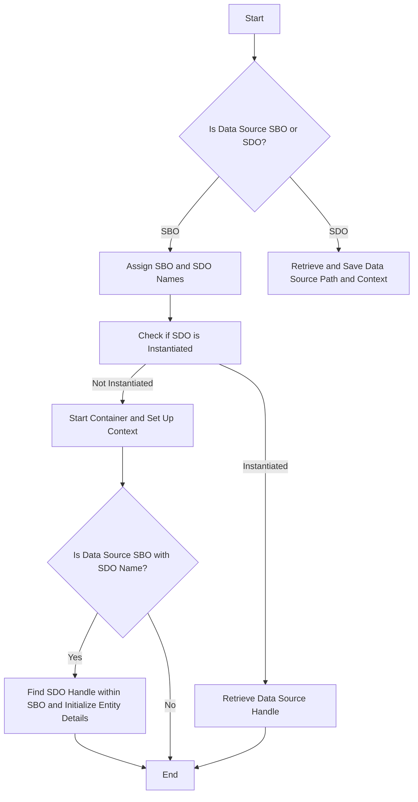

This document will cover the process of handling data sources, which includes:

1. Determining if the data source is a Smart Business Object (SBO) or a Standard Data Object (SDO)
2. Managing the context for the data source
3. Handling the initialization and retrieval of data source handles.

Technical document: <SwmLink doc-title="Handling Data Sources Flow">[Handling Data Sources Flow](/.swm%5Chandling-data-sources-flow.ulugd7j7.sw.md)</SwmLink>

# [Determining if the Data Source is an SBO](https://app.swimm.io/repos/Z2l0aHViJTNBJTNBT3BlbkVkZ2VfUmV0aXJlZF9Qcm9kdWN0cyUzQSUzQVBBUFA5Mg==/docs/ulugd7j7#determining-if-the-data-source-is-an-sbo)

The process begins by identifying whether the data source (DS) is a Smart Business Object (SBO) or a Standard Data Object (SDO). This is done by checking a saved property 'isSBO'. If the property indicates that the DS is an SBO, it will be treated differently in subsequent steps.

# [Finding the SBO and SDO Names](https://app.swimm.io/repos/Z2l0aHViJTNBJTNBT3BlbkVkZ2VfUmV0aXJlZF9Qcm9kdWN0cyUzQSUzQVBBUFA5Mg==/docs/ulugd7j7#finding-the-sbo-and-sdo-names)

If the data source is identified as an SBO or has multiple entries, the system assigns names to the SBO and SDO by parsing the data source name. This step is crucial for correctly identifying and managing the handles for the SBO and SDO.

# [Managing the Context for the Data Source](https://app.swimm.io/repos/Z2l0aHViJTNBJTNBT3BlbkVkZ2VfUmV0aXJlZF9Qcm9kdWN0cyUzQSUzQVBBUFA5Mg==/docs/ulugd7j7#managing-the-context-for-the-data-source)

The context for the data source is managed by retrieving and saving the data source path and context. If the SDO has not been instantiated, the system starts the container and sets up the context. This ensures that the data source is correctly initialized and ready for use.

# [Handling SBO and SDO](https://app.swimm.io/repos/Z2l0aHViJTNBJTNBT3BlbkVkZ2VfUmV0aXJlZF9Qcm9kdWN0cyUzQSUzQVBBUFA5Mg==/docs/ulugd7j7#handling-sbo-and-sdo)

If the data source is an SBO and has an SDO name, the system finds the SDO handle within the SBO and initializes entity details. If these conditions are not met, the system simply returns the data source handle directly. This step ensures that the correct data source handle is retrieved and initialized based on the type of data source.

&nbsp;

*This is an auto-generated document by Swimm 🌊 and has not yet been verified by a human*

<SwmMeta version="3.0.0" repo-id="Z2l0aHViJTNBJTNBT3BlbkVkZ2VfUmV0aXJlZF9Qcm9kdWN0cyUzQSUzQVBBUFA5Mg==" repo-name="OpenEdge_Retired_Products">Powered by [Swimm](/)</SwmMeta>
