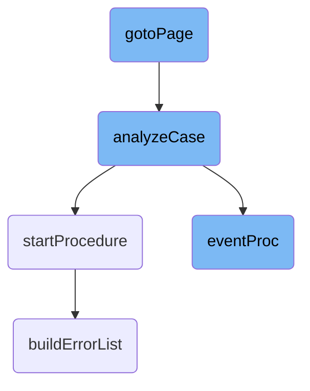

This document explains the process of navigating to a specific page using the <SwmToken path="dynamics/src/main/abl/install/prc/inuimngrp.p" pos="1016:7:7" line-data="&amp;IF DEFINED(EXCLUDE-gotoPage) = 0 &amp;THEN">`gotoPage`</SwmToken> function. The function determines the type of page name and calls the appropriate functions to analyze and initialize the page.

The flow starts with the <SwmToken path="dynamics/src/main/abl/install/prc/inuimngrp.p" pos="1016:7:7" line-data="&amp;IF DEFINED(EXCLUDE-gotoPage) = 0 &amp;THEN">`gotoPage`</SwmToken> function, which checks the type of page name. If the page name is a case expression, it calls <SwmToken path="dynamics/src/main/abl/install/prc/inuimngrp.p" pos="1066:5:5" line-data="      cPage = analyzeCase(pcPageName).">`analyzeCase`</SwmToken>; if it's an if expression, it calls <SwmToken path="dynamics/src/main/abl/install/prc/inuimngrp.p" pos="1068:5:5" line-data="      cPage = analyzeIf(pcPageName).">`analyzeIf`</SwmToken>. Otherwise, it uses the page name directly. After determining the correct page, it initializes the page using <SwmToken path="dynamics/src/main/abl/install/prc/inuimngrp.p" pos="1074:3:3" line-data="  RUN initializePage(cPage) NO-ERROR.">`initializePage`</SwmToken>. If there is an error during initialization, it returns an error status. The flow may also involve handling events and starting procedures based on the analyzed page.

# Flow drill down



<SwmSnippet path="/dynamics/src/main/abl/install/prc/inuimngrp.p" line="1064">

---

## Handling different types of page names

The <SwmToken path="dynamics/src/main/abl/install/prc/inuimngrp.p" pos="1016:7:7" line-data="&amp;IF DEFINED(EXCLUDE-gotoPage) = 0 &amp;THEN">`gotoPage`</SwmToken> function handles different types of page names. It checks if the page name is a case expression, an if expression, or a simple page name. Based on the type, it calls the appropriate function (<SwmToken path="dynamics/src/main/abl/install/prc/inuimngrp.p" pos="1066:5:5" line-data="      cPage = analyzeCase(pcPageName).">`analyzeCase`</SwmToken> or <SwmToken path="dynamics/src/main/abl/install/prc/inuimngrp.p" pos="1068:5:5" line-data="      cPage = analyzeIf(pcPageName).">`analyzeIf`</SwmToken>) to determine the actual page to navigate to.

```openedge abl
  CASE SUBSTRING(pcPageName,1,1):
    WHEN ":":U THEN
      cPage = analyzeCase(pcPageName).
    WHEN "?":U THEN
      cPage = analyzeIf(pcPageName).
    OTHERWISE
      cPage = pcPageName.
  END CASE.
```

---

</SwmSnippet>

<SwmSnippet path="/dynamics/src/main/abl/install/prc/inuimngrp.p" line="1073">

---

## Initializing the page

After determining the page to navigate to, the <SwmToken path="dynamics/src/main/abl/install/prc/inuimngrp.p" pos="1016:7:7" line-data="&amp;IF DEFINED(EXCLUDE-gotoPage) = 0 &amp;THEN">`gotoPage`</SwmToken> function calls <SwmToken path="dynamics/src/main/abl/install/prc/inuimngrp.p" pos="1074:3:3" line-data="  RUN initializePage(cPage) NO-ERROR.">`initializePage`</SwmToken> to set up the page. If there is an error during initialization, it returns an error status.

```openedge abl
  /* Now initialize the page */
  RUN initializePage(cPage) NO-ERROR.
  IF ERROR-STATUS:ERROR THEN
    RETURN ERROR.
```

---

</SwmSnippet>

<SwmSnippet path="/dynamics/src/main/abl/install/prc/inuimngrp.p" line="215">

---

### Analyzing case expressions

The <SwmToken path="dynamics/src/main/abl/install/prc/inuimngrp.p" pos="1066:5:5" line-data="      cPage = analyzeCase(pcPageName).">`analyzeCase`</SwmToken> function is called when the page name is a case expression. It evaluates the expression to determine the correct page to navigate to.

```openedge abl
  .
```

---

</SwmSnippet>

<SwmSnippet path="/dynamics/src/main/abl/install/prc/inuimngrp.p" line="738">

---

### Handling events

The <SwmToken path="dynamics/src/main/abl/install/prc/inuimngrp.p" pos="398:3:3" line-data="  RUN eventProc (&quot;CHOOSE&quot;:U,SELF:NAME) NO-ERROR.">`eventProc`</SwmToken> function is called to handle events for objects. This function is part of the flow after <SwmToken path="dynamics/src/main/abl/install/prc/inuimngrp.p" pos="1016:7:7" line-data="&amp;IF DEFINED(EXCLUDE-gotoPage) = 0 &amp;THEN">`gotoPage`</SwmToken> and <SwmToken path="dynamics/src/main/abl/install/prc/inuimngrp.p" pos="1066:5:5" line-data="      cPage = analyzeCase(pcPageName).">`analyzeCase`</SwmToken>.

```openedge abl
END PROCEDURE.
```

---

</SwmSnippet>

<SwmSnippet path="/dynamics/src/main/abl/af/app/afxmlcfgp.p" line="2146">

---

### Starting procedures

The <SwmToken path="dynamics/src/main/abl/af/app/afxmlcfgp.p" pos="2146:2:2" line-data="PROCEDURE startProcedure :">`startProcedure`</SwmToken> function is called to determine the name of the procedure to start and how to start it. This function is part of the flow after <SwmToken path="dynamics/src/main/abl/install/prc/inuimngrp.p" pos="1066:5:5" line-data="      cPage = analyzeCase(pcPageName).">`analyzeCase`</SwmToken>.

```openedge abl
PROCEDURE startProcedure :
```

---

</SwmSnippet>

&nbsp;

*This is an auto-generated document by Swimm 🌊 and has not yet been verified by a human*

<SwmMeta version="3.0.0" repo-id="Z2l0aHViJTNBJTNBT3BlbkVkZ2VfUmV0aXJlZF9Qcm9kdWN0cyUzQSUzQVBBUFA5Mg==" repo-name="OpenEdge_Retired_Products"><sup>Powered by [Swimm](/)</sup></SwmMeta>
