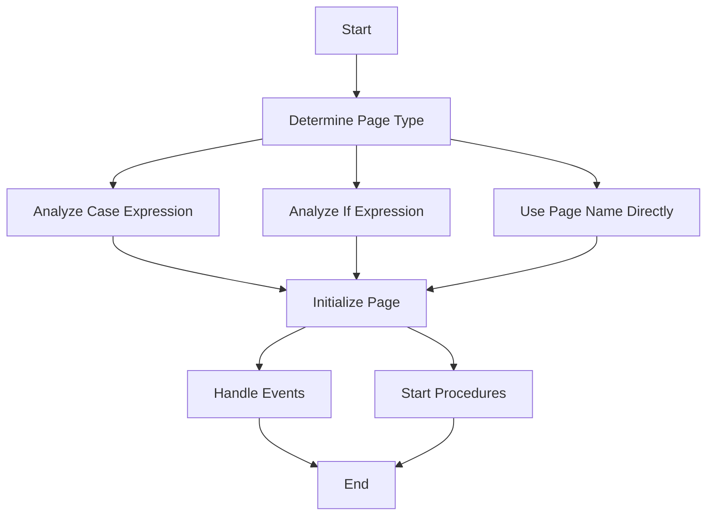

This document will cover the process of navigating to a specific page within the application. We'll cover:

1. Determining the type of page name
2. Initializing the page
3. Handling events and starting procedures

Technical document: <SwmLink doc-title="Navigating to a Page">[Navigating to a Page](/.swm%5Cnavigating-to-a-page.hpvdq6g0.sw.md)</SwmLink>

# [Determining the type of page name](https://app.swimm.io/repos/Z2l0aHViJTNBJTNBT3BlbkVkZ2VfUmV0aXJlZF9Qcm9kdWN0cyUzQSUzQVBBUFA5Mg==/docs/hpvdq6g0#handling-different-types-of-page-names)

The process begins by determining the type of page name provided. The system checks if the page name is a case expression, an if expression, or a simple page name. If the page name starts with a colon (':'), it is treated as a case expression and the `analyzeCase` function is called. If it starts with a question mark ('?'), it is treated as an if expression and the `analyzeIf` function is called. Otherwise, the page name is used directly. This step ensures that the correct page is identified for navigation.

# [Initializing the page](https://app.swimm.io/repos/Z2l0aHViJTNBJTNBT3BlbkVkZ2VfUmV0aXJlZF9Qcm9kdWN0cyUzQSUzQVBBUFA5Mg==/docs/hpvdq6g0#initializing-the-page)

Once the correct page has been determined, the next step is to initialize the page. The `initializePage` function is called to set up the page. This involves loading the necessary resources and preparing the page for user interaction. If there is an error during this process, an error status is returned. This step is crucial for ensuring that the page is ready for use and that any issues are promptly identified and handled.

# [Handling events and starting procedures](https://app.swimm.io/repos/Z2l0aHViJTNBJTNBT3BlbkVkZ2VfUmV0aXJlZF9Qcm9kdWN0cyUzQSUzQVBBUFA5Mg==/docs/hpvdq6g0#handling-events)

After the page has been initialized, the system may need to handle events and start specific procedures based on the analyzed page. The `eventProc` function is called to manage events for objects on the page. Additionally, the `startProcedure` function determines the name of the procedure to start and how to start it. These steps ensure that the page functions correctly and that any necessary actions are performed automatically.

&nbsp;

*This is an auto-generated document by Swimm 🌊 and has not yet been verified by a human*

<SwmMeta version="3.0.0" repo-id="Z2l0aHViJTNBJTNBT3BlbkVkZ2VfUmV0aXJlZF9Qcm9kdWN0cyUzQSUzQVBBUFA5Mg==" repo-name="OpenEdge_Retired_Products">Powered by [Swimm](/)</SwmMeta>
