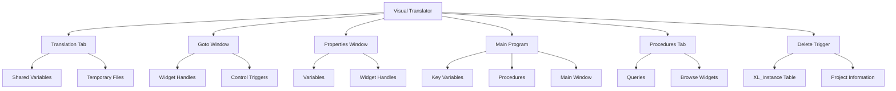

# Overview of Visual Translator

The Visual Translator is a component of the OpenEdge ABL software designed to facilitate the translation of application text. It includes various functionalities such as managing translation properties, handling translation tabs, and providing search capabilities.

# Directory Structure

The 'vt' directory in 'adetran' contains various files related to the Visual Translator component. Each file serves a specific purpose in the overall functionality of the Visual Translator.

<SwmSnippet path="/adetran/src/main/abl/adetran/vt/vthlp.i" line="1">

---

The <SwmPath>[adetran/src/main/abl/adetran/vt/vthlp.i](adetran/src/main/abl/adetran/vt/vthlp.i)</SwmPath> file defines global constants for help context strings used throughout the Visual Translator.

```i
/*********************************************************************
* Copyright (C) 2000,2020 by Progress Software Corporation. All      *
* rights reserved. Prior versions of this work may contain portions  *
* contributed by participants of Possenet.                           *
*                                                                    *
```

---

</SwmSnippet>

# Key Procedures

The Visual Translator includes several key procedures that handle various functionalities. One such procedure is the <SwmToken path="adetran/src/main/abl/adetran/vt/_find.w" pos="751:13:13" line-data="&amp;ANALYZE-SUSPEND _UIB-CODE-BLOCK _PROCEDURE nextInstanceSource FindWindow ">`nextInstanceSource`</SwmToken> procedure.

<SwmSnippet path="/adetran/src/main/abl/adetran/vt/_find.w" line="751">

---

The <SwmToken path="adetran/src/main/abl/adetran/vt/_find.w" pos="751:13:13" line-data="&amp;ANALYZE-SUSPEND _UIB-CODE-BLOCK _PROCEDURE nextInstanceSource FindWindow ">`nextInstanceSource`</SwmToken> procedure in <SwmPath>[adetran/src/main/abl/adetran/vt/\_find.w](adetran/src/main/abl/adetran/vt/_find.w)</SwmPath> is used to search for the next record in the <SwmToken path="adetran/src/main/abl/adetran/vt/_find.w" pos="753:25:25" line-data="  /* &quot;Find&quot; code to search for the next record in the XL_Instance">`XL_Instance`</SwmToken> table whose <SwmToken path="adetran/src/main/abl/adetran/vt/_find.w" pos="754:5:5" line-data="     table whose SourcePhrase field matches the search criteria. (tomn 10/99) */">`SourcePhrase`</SwmToken> field matches the search criteria.

```c
&ANALYZE-SUSPEND _UIB-CODE-BLOCK _PROCEDURE nextInstanceSource FindWindow 
PROCEDURE nextInstanceSource :
  /* "Find" code to search for the next record in the XL_Instance
     table whose SourcePhrase field matches the search criteria. (tomn 10/99) */

  DO WITH FRAME DEFAULT-FRAME:
    {adetran/vt/_find.i kit.XL_Instance SourcePhrase NEXT StringKey}
  END.
```

---

</SwmSnippet>



&nbsp;

*This is an auto-generated document by Swimm 🌊 and has not yet been verified by a human*

<SwmMeta version="3.0.0" repo-id="Z2l0aHViJTNBJTNBT3BlbkVkZ2VfUmV0aXJlZF9Qcm9kdWN0cyUzQSUzQVBBUFA5Mg==" repo-name="OpenEdge_Retired_Products"><sup>Powered by [Swimm](/)</sup></SwmMeta>
