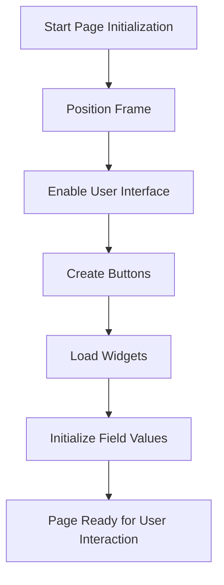

This document will cover the Page Initialization Process, which includes:

1. Positioning the frame
2. Enabling the user interface
3. Creating buttons
4. Loading widgets
5. Initializing field values.

Technical document: <SwmLink doc-title="Page Initialization Process">[Page Initialization Process](/.swm%5Cpage-initialization-process.t1pocd8z.sw.md)</SwmLink>

# [Positioning the Frame](https://app.swimm.io/repos/Z2l0aHViJTNBJTNBT3BlbkVkZ2VfUmV0aXJlZF9Qcm9kdWN0cyUzQSUzQVBBUFA5Mg==/docs/t1pocd8z#initializing-the-page)

The first step in the page initialization process is to position the frame correctly on the screen. This involves setting the frame's coordinates (X and Y positions) and ensuring it is visible to the user. Proper positioning is essential to provide a consistent and user-friendly interface, ensuring that all UI elements are displayed in their intended locations.

# [Enabling the User Interface](https://app.swimm.io/repos/Z2l0aHViJTNBJTNBT3BlbkVkZ2VfUmV0aXJlZF9Qcm9kdWN0cyUzQSUzQVBBUFA5Mg==/docs/t1pocd8z#initializing-the-page)

Once the frame is positioned, the next step is to enable the user interface. This makes all UI elements interactive, allowing users to engage with buttons, fields, and other components. Enabling the UI is crucial for ensuring that the application is responsive to user actions and provides a seamless experience.

# [Creating Buttons](https://app.swimm.io/repos/Z2l0aHViJTNBJTNBT3BlbkVkZ2VfUmV0aXJlZF9Qcm9kdWN0cyUzQSUzQVBBUFA5Mg==/docs/t1pocd8z#initializing-the-page)

After enabling the UI, buttons are created and added to the frame. These buttons provide users with actionable options, such as submitting forms or navigating to different sections of the application. Creating buttons is a key step in making the application functional and user-friendly.

# [Loading Widgets](https://app.swimm.io/repos/Z2l0aHViJTNBJTNBT3BlbkVkZ2VfUmV0aXJlZF9Qcm9kdWN0cyUzQSUzQVBBUFA5Mg==/docs/t1pocd8z#initializing-the-page)

Widgets are then loaded onto the page. Widgets can include various UI components such as text fields, dropdowns, and checkboxes. Loading widgets ensures that all necessary elements are available for user interaction, contributing to a complete and functional user interface.

# [Initializing Field Values](https://app.swimm.io/repos/Z2l0aHViJTNBJTNBT3BlbkVkZ2VfUmV0aXJlZF9Qcm9kdWN0cyUzQSUzQVBBUFA5Mg==/docs/t1pocd8z#initializing-the-page)

The final step in the page initialization process is to initialize field values. This involves setting default values for input fields and other data entry points. Initializing field values ensures that users have a clear starting point for their interactions, improving usability and reducing the likelihood of errors.

&nbsp;

*This is an auto-generated document by Swimm 🌊 and has not yet been verified by a human*

<SwmMeta version="3.0.0" repo-id="Z2l0aHViJTNBJTNBT3BlbkVkZ2VfUmV0aXJlZF9Qcm9kdWN0cyUzQSUzQVBBUFA5Mg==" repo-name="OpenEdge_Retired_Products">Powered by [Swimm](/)</SwmMeta>
