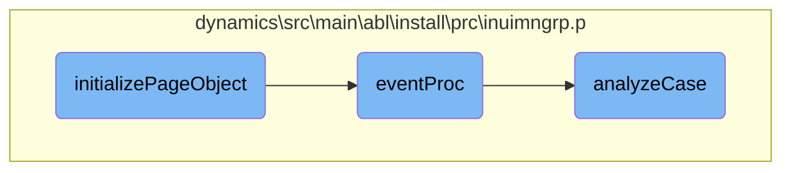

This document outlines the process of initializing a page object within the application. The initialization process is crucial for setting up the user interface correctly, ensuring that all elements are in place and ready for user interaction.

The process starts with positioning the frame correctly on the screen. Next, the user interface is enabled, which makes the UI elements interactive. Buttons are then created and added to the frame. Finally, widgets are loaded, and field values are initialized to ensure that the page is fully functional and ready for the user.

# Flow drill down



<SwmSnippet path="/dynamics/src/main/abl/install/prc/inuimngrp.p" line="1344">

---

## Initializing the Page

The <SwmToken path="dynamics/src/main/abl/install/prc/inuimngrp.p" pos="1344:2:2" line-data="PROCEDURE initializePageObject :">`initializePageObject`</SwmToken> function is responsible for setting up the initial state of the page. It positions the frame, enables the UI, creates buttons, loads widgets, and initializes field values. This ensures that the user interface is correctly displayed and ready for interaction.

```openedge abl
PROCEDURE initializePageObject :
/*------------------------------------------------------------------------------
  Purpose:     Does the standard behavior for initializing the page
  Parameters:  <none>
  Notes:       
------------------------------------------------------------------------------*/
  DEFINE INPUT  PARAMETER pdPageObj   AS DECIMAL    NO-UNDO.
  DEFINE VARIABLE hWin AS HANDLE     NO-UNDO.

  /* Put the frame in the right place on the screen */
  ghCurrFrame:HIDDEN = TRUE.
  ghCurrFrame:FRAME = ghParentFrame.
  ghCurrFrame:X = 145.
  ghCurrFrame:Y = 9.
  ghCurrFrame:HIDDEN = FALSE.

  /* Run enable_UI */
  RUN enable_UI IN ghCurrPage.

  /* Create the buttons */
  RUN createButtons(pdPageObj, ghParentFrame).
```

---

</SwmSnippet>

<SwmSnippet path="/dynamics/src/main/abl/install/prc/inuimngrp.p" line="748">

---

## Handling Events

The <SwmToken path="dynamics/src/main/abl/install/prc/inuimngrp.p" pos="748:2:2" line-data="PROCEDURE eventProc :">`eventProc`</SwmToken> function handles various events triggered by user interactions. It processes events like button clicks and window close actions. Depending on the event, it may execute specific actions, such as quitting the application or running a dynamic function. This function ensures that user actions are appropriately handled and the application responds correctly.

```openedge abl
PROCEDURE eventProc :
/*------------------------------------------------------------------------------
  Purpose:     This procedure handles events for objects.
  Parameters:  <none>
  Notes:       
------------------------------------------------------------------------------*/
  DEFINE INPUT  PARAMETER pcEvent  AS CHARACTER  NO-UNDO.
  DEFINE INPUT  PARAMETER pcObject AS CHARACTER  NO-UNDO.

  DEFINE VARIABLE hProc          AS HANDLE     NO-UNDO.
  DEFINE VARIABLE hLastWidget    AS HANDLE     NO-UNDO.
  DEFINE VARIABLE cLastWidget    AS CHARACTER  NO-UNDO.
  DEFINE VARIABLE cSkipButtons   AS CHARACTER  NO-UNDO.
  DEFINE VARIABLE iRetVal        AS INTEGER    NO-UNDO.
  DEFINE VARIABLE dCurrParentObj AS DECIMAL    NO-UNDO.  
  DEFINE VARIABLE cMessage       AS CHARACTER  NO-UNDO.
  DEFINE VARIABLE cAction        AS CHARACTER  NO-UNDO.

  DEFINE BUFFER bttSetup   FOR ttSetup.
  DEFINE BUFFER bttAction  FOR ttAction.
  DEFINE BUFFER bttPage    FOR ttPage.
```

---

</SwmSnippet>

<SwmSnippet path="/dynamics/src/main/abl/install/prc/inuimngrp.p" line="215">

---

### Analyzing Case Statements

The <SwmToken path="dynamics/src/main/abl/install/prc/inuimngrp.p" pos="236:7:7" line-data="&amp;IF DEFINED(EXCLUDE-analyzeCase) = 0 &amp;THEN">`analyzeCase`</SwmToken> function evaluates case statements and determines the appropriate action to take based on the given conditions. It checks the operand against various cases and returns the corresponding action. This function is crucial for decision-making processes within the application, ensuring that the correct actions are taken based on specific conditions.

```openedge abl
  .

/* _UIB-CODE-BLOCK-END */
&ANALYZE-RESUME


&ANALYZE-SUSPEND _UIB-PREPROCESSOR-BLOCK 

/* ********************  Preprocessor Definitions  ******************** */

&Scoped-define PROCEDURE-TYPE Procedure
&Scoped-define DB-AWARE no


/* _UIB-PREPROCESSOR-BLOCK-END */
&ANALYZE-RESUME


/* ************************  Function Prototypes ********************** */

```

---

</SwmSnippet>

&nbsp;

*This is an auto-generated document by Swimm 🌊 and has not yet been verified by a human*

<SwmMeta version="3.0.0" repo-id="Z2l0aHViJTNBJTNBT3BlbkVkZ2VfUmV0aXJlZF9Qcm9kdWN0cyUzQSUzQVBBUFA5Mg==" repo-name="OpenEdge_Retired_Products"><sup>Powered by [Swimm](/)</sup></SwmMeta>
