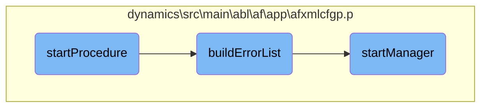
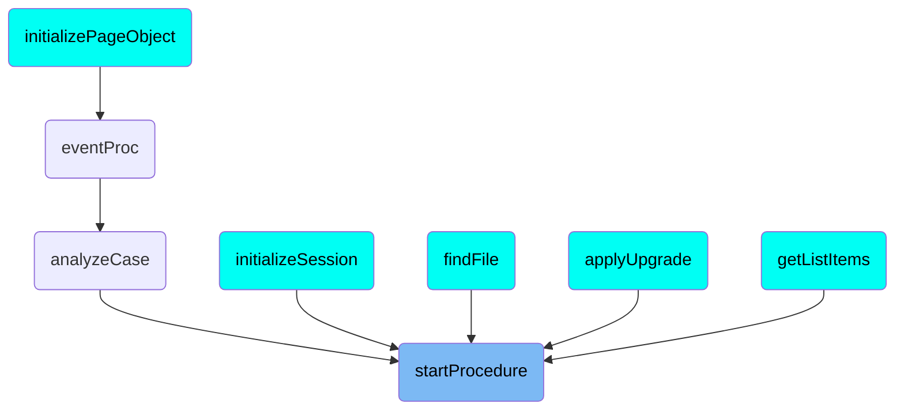

This document explains the process of determining and starting a procedure. The process involves parsing the procedure name, handling errors, and starting necessary managers.

The flow starts by determining the name of the procedure to start and how to start it. It parses the procedure name to extract the mode and procedure name. If the mode is not specified, it defaults to 'EXEC'. After attempting to run the procedure, it checks for errors. If any errors are found, it returns an error message along with a detailed error list. Finally, it starts all the managers that need to be run before the session manager, ensuring they are persistent and do not require any parameters.

# Flow drill down



<SwmSnippet path="/dynamics/src/main/abl/af/app/afxmlcfgp.p" line="2145">

---

## Determining the Procedure to Start

The <SwmToken path="dynamics/src/main/abl/af/app/afxmlcfgp.p" pos="2145:13:13" line-data="&amp;ANALYZE-SUSPEND _UIB-CODE-BLOCK _PROCEDURE startProcedure Procedure ">`startProcedure`</SwmToken> function determines the name of the procedure to start and how to start it. It parses the <SwmToken path="dynamics/src/main/abl/af/app/afxmlcfgp.p" pos="2153:7:7" line-data="  DEFINE INPUT  PARAMETER pcProcName AS CHARACTER  NO-UNDO.">`pcProcName`</SwmToken> parameter to extract the mode and procedure name. If the mode is not specified, it defaults to 'EXEC'.

```openedge abl
&ANALYZE-SUSPEND _UIB-CODE-BLOCK _PROCEDURE startProcedure Procedure 
PROCEDURE startProcedure :
/*------------------------------------------------------------------------------
  Purpose:     Determines the name of the procedure to start and how to start
               it.
  Parameters:  <none>
  Notes:       
------------------------------------------------------------------------------*/
  DEFINE INPUT  PARAMETER pcProcName AS CHARACTER  NO-UNDO.
  DEFINE OUTPUT PARAMETER phHandle   AS HANDLE     NO-UNDO.

  DEFINE VARIABLE cMode        AS CHARACTER  NO-UNDO.
  DEFINE VARIABLE cProcName    AS CHARACTER  NO-UNDO.
  DEFINE VARIABLE cFileName    AS CHARACTER  NO-UNDO.
  DEFINE VARIABLE cLogicalName AS CHARACTER  NO-UNDO.
  DEFINE VARIABLE hProc        AS HANDLE     NO-UNDO.

  DEFINE VARIABLE lMultiInstance              AS LOGICAL      NO-UNDO.
  DEFINE VARIABLE cChildDataKey               AS CHARACTER    NO-UNDO.
  DEFINE VARIABLE cRunAttribute               AS CHARACTER    NO-UNDO.
  DEFINE VARIABLE hContainerWindow            AS HANDLE       NO-UNDO.
```

---

</SwmSnippet>

<SwmSnippet path="/dynamics/src/main/abl/af/app/afxmlcfgp.p" line="2281">

---

## Handling Errors

The function checks for errors after attempting to run the procedure. If any errors are found, it returns an error message concatenated with the output of <SwmToken path="dynamics/src/main/abl/af/app/afxmlcfgp.p" pos="2284:18:18" line-data="    RETURN ERROR RETURN-VALUE + CHR(10) + buildErrorList().      ">`buildErrorList`</SwmToken>.

```openedge abl
  IF ERROR-STATUS:ERROR OR
     (RETURN-VALUE <> "":U AND
      RETURN-VALUE <> ?) THEN 
    RETURN ERROR RETURN-VALUE + CHR(10) + buildErrorList().      

```

---

</SwmSnippet>

<SwmSnippet path="/dynamics/src/main/abl/af/app/afxmlcfgp.p" line="140">

---

## Building the Error List

The <SwmToken path="dynamics/src/main/abl/af/app/afxmlcfgp.p" pos="2284:18:18" line-data="    RETURN ERROR RETURN-VALUE + CHR(10) + buildErrorList().      ">`buildErrorList`</SwmToken> function constructs a list of error messages from the <SwmToken path="dynamics/src/main/abl/af/app/afxmlcfgp.p" pos="2281:3:5" line-data="  IF ERROR-STATUS:ERROR OR">`ERROR-STATUS`</SwmToken> object. This list is used to provide detailed error information when a procedure fails to start.

```openedge abl
{adecomm/_adetool.i}

/* _UIB-CODE-BLOCK-END */
&ANALYZE-RESUME


&ANALYZE-SUSPEND _UIB-PREPROCESSOR-BLOCK 

/* ********************  Preprocessor Definitions  ******************** */
```

---

</SwmSnippet>

<SwmSnippet path="/dynamics/src/main/abl/af/app/afxmlcfgp.p" line="1960">

---

## Starting the Manager

The <SwmToken path="dynamics/src/main/abl/af/app/afxmlcfgp.p" pos="1960:13:13" line-data="&amp;ANALYZE-SUSPEND _UIB-CODE-BLOCK _PROCEDURE startManager Procedure ">`startManager`</SwmToken> function is responsible for starting all the managers that need to be run before the session manager. It ensures that the managers are persistent and do not require any parameters.

```openedge abl
&ANALYZE-SUSPEND _UIB-CODE-BLOCK _PROCEDURE startManager Procedure 
PROCEDURE startManager :
/*------------------------------------------------------------------------------
  Purpose:     Starts all the managers that need to be run prior to the
               start of the session manager. 
  Parameters:  
    pcManagerName = corresponds to a manager in the ttManager table.
    phManager     = returned handle to the started procedure.

  Notes:
    All the managers that are started using this procedure need to be 
    persistent and should not require any parameters. 

    It is possible that the ttManager table contains more than one entry
    for a specific file. For example, the Session Manager and Context Manager
    may be the same procedure. If that's the case we need to use the same
    instance of the procedure in both cases. 
------------------------------------------------------------------------------*/
```

---

</SwmSnippet>

# Where is this flow used?

This flow is used multiple times in the codebase as represented in the following diagram:

(Note - these are only some of the entry points of this flow)



&nbsp;

*This is an auto-generated document by Swimm 🌊 and has not yet been verified by a human*

<SwmMeta version="3.0.0" repo-id="Z2l0aHViJTNBJTNBT3BlbkVkZ2VfUmV0aXJlZF9Qcm9kdWN0cyUzQSUzQVBBUFA5Mg==" repo-name="OpenEdge_Retired_Products"><sup>Powered by [Swimm](/)</sup></SwmMeta>
