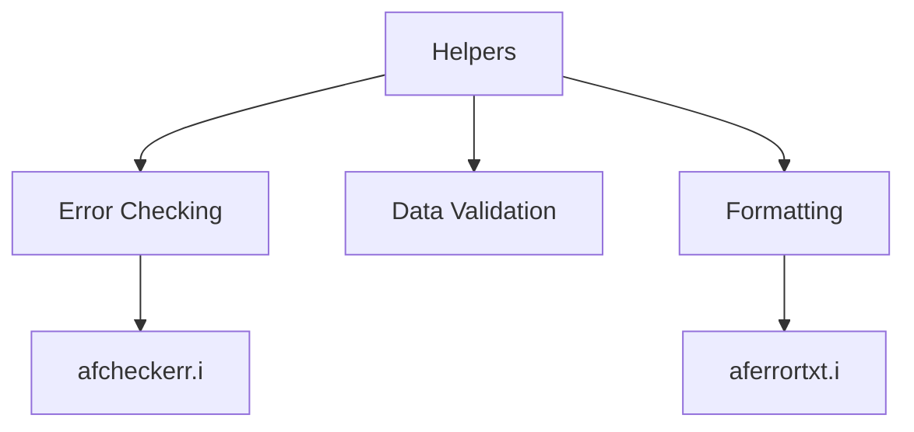

# Understanding Helper Functions

Helpers are utility functions or procedures designed to perform common tasks or calculations. They simplify and streamline the code by encapsulating repetitive or complex operations into reusable components.

# Purpose of Helpers

In Dynamics, helpers are often used to handle tasks such as error checking, data validation, and formatting. This allows developers to maintain cleaner and more maintainable code by reducing redundancy and improving readability.

# Example of Helpers

Helpers can be found in various files within the Dynamics project. For instance, the file <SwmPath>[dynamics/src/main/abl/af/sup2/afcheckerr.i](dynamics/src/main/abl/af/sup2/afcheckerr.i)</SwmPath> is used to check for errors and handle them appropriately. These helper files contain predefined logic that can be invoked whenever needed, ensuring consistency and reducing the likelihood of errors.

<SwmSnippet path="/dynamics/src/main/abl/af/sup2/aferrortxt.i" line="13">

---

The file <SwmPath>[dynamics/src/main/abl/af/sup2/aferrortxt.i](dynamics/src/main/abl/af/sup2/aferrortxt.i)</SwmPath> contains helper logic to format error messages, demonstrating how helpers encapsulate common tasks. This include returns an error message string formatted to conform to how the Astra <SwmToken path="dynamics/src/main/abl/af/sup2/aferrortxt.i" pos="14:3:3" line-data="   Astra showMessages function expects a standard error message.">`showMessages`</SwmToken> function expects a standard error message. The format also conforms to the format expected by <SwmToken path="dynamics/src/main/abl/af/sup2/aferrortxt.i" pos="15:19:19" line-data="   The format also conforms to the format expected by ADM2 as:">`ADM2`</SwmToken> as: message + <SwmToken path="dynamics/src/main/abl/af/sup2/aferrortxt.i" pos="16:5:7" line-data="   message + CHR(4) + field + CHR(4) + table">`CHR(4`</SwmToken>) + field + <SwmToken path="dynamics/src/main/abl/af/sup2/aferrortxt.i" pos="16:5:7" line-data="   message + CHR(4) + field + CHR(4) + table">`CHR(4`</SwmToken>) + table but we do add two extra <SwmToken path="dynamics/src/main/abl/af/sup2/aferrortxt.i" pos="16:5:7" line-data="   message + CHR(4) + field + CHR(4) + table">`CHR(4`</SwmToken>) delimited entries for program name 1 and 2.

```i
   This include returns an error message string formatted to conform to how the
   Astra showMessages function expects a standard error message.
   The format also conforms to the format expected by ADM2 as:
   message + CHR(4) + field + CHR(4) + table
   but we do add two extra CHR(4) delimited entries for program name 1 and 2.

   The Include takes input parameters as follows:
   {1} = Error group, e.g. AF or ? if hard coded message
   {2} = Error number, e.g. 1 or hard coded message text
   {3} = Table, e.g. gsm_user
   {4} = Field, eg. user_login_name
   {5-13} = Extra insertion arguements for error message, 9 supported 
   The include file will result in a quoted string as follows:
   "group^number^prog1:prog2^insert1|insert2|insert3,etcCHR(4)fieldnameCHR(4)tablenameCHR(4)prog1CHR(4)prog2"

   NOTES:
   Arguments must be passed as unquoted variables or single quoted literals, e.g. 'text'
   If literal contains spaces, then it must also be in dounble quotes, e.g. "'test space'"
   If double quotes are used, these are dropped automatically.
   If an arguement in the middle needs to be ommitted, a placeholder of '?' must be used 
   The simplest use for an error with no insertion codes would be:
```

---

</SwmSnippet>



&nbsp;

*This is an auto-generated document by Swimm 🌊 and has not yet been verified by a human*

<SwmMeta version="3.0.0" repo-id="Z2l0aHViJTNBJTNBT3BlbkVkZ2VfUmV0aXJlZF9Qcm9kdWN0cyUzQSUzQVBBUFA5Mg==" repo-name="OpenEdge_Retired_Products"><sup>Powered by [Swimm](/)</sup></SwmMeta>
