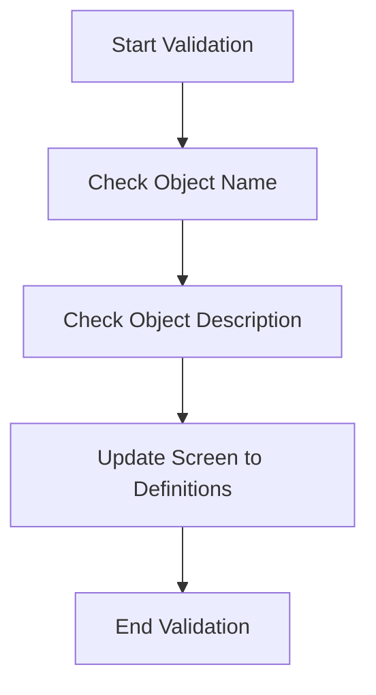

This document will cover the process of validating a window, which includes:

1. Checking the object name
2. Checking the object description
3. Updating the screen to definitions.

Technical document: <SwmLink doc-title="Validating a Window">[Validating a Window](/.swm%5Cvalidating-a-window.ndvqfcxz.sw.md)</SwmLink>

# [Checking the Object Name](https://app.swimm.io/repos/Z2l0aHViJTNBJTNBT3BlbkVkZ2VfUmV0aXJlZF9Qcm9kdWN0cyUzQSUzQVBBUFA5Mg==/docs/ndvqfcxz#checking-object-name)

The first step in validating a window is to check if the object name is present and correct. This ensures that the window has a unique identifier. If the object name is missing, an error message is returned, prompting the user to update the object name. If the object name is present but incorrect, another error message is returned, asking the user to correct the object name. This step is crucial for maintaining data integrity and ensuring that each window can be uniquely identified.

# [Checking the Object Description](https://app.swimm.io/repos/Z2l0aHViJTNBJTNBT3BlbkVkZ2VfUmV0aXJlZF9Qcm9kdWN0cyUzQSUzQVBBUFA5Mg==/docs/ndvqfcxz#checking-object-description)

The next step is to verify that the object description is present. The object description provides additional context about the window, making it easier for users to understand its purpose. If the description is missing, an error message is returned, prompting the user to update the object description. This step ensures that all necessary information about the window is provided, which is essential for user comprehension and effective use of the window.

# [Updating Screen to Definitions](https://app.swimm.io/repos/Z2l0aHViJTNBJTNBT3BlbkVkZ2VfUmV0aXJlZF9Qcm9kdWN0cyUzQSUzQVBBUFA5Mg==/docs/ndvqfcxz#updating-screen-to-definitions)

The final step in the validation process is to update the screen values to match the latest definitions from the SCM (Source Control Management). This ensures that all relevant fields such as object name, description, purpose, and version notes are correctly displayed on the screen. By doing this, we ensure that the user sees the most up-to-date and accurate information, which is crucial for making informed decisions and maintaining consistency across the application.

&nbsp;

*This is an auto-generated document by Swimm 🌊 and has not yet been verified by a human*

<SwmMeta version="3.0.0" repo-id="Z2l0aHViJTNBJTNBT3BlbkVkZ2VfUmV0aXJlZF9Qcm9kdWN0cyUzQSUzQVBBUFA5Mg==" repo-name="OpenEdge_Retired_Products">Powered by [Swimm](/)</SwmMeta>
