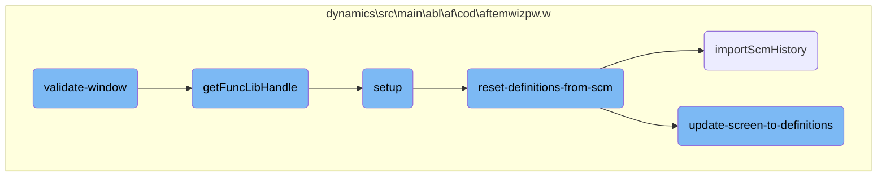

In this document, we will explain the process of validating a window. The validation process ensures that all necessary fields in the window are correctly filled out and provides feedback if there are any issues.

The flow starts by checking if the object name is present and correct. If the object name is missing or incorrect, an error message is returned. Next, it verifies the object description, ensuring it is present. If the description is missing, an error message is returned. This process helps maintain data integrity by ensuring all required fields are properly filled out before proceeding.

# Flow drill down



<SwmSnippet path="/dynamics/src/main/abl/af/cod/aftemwizpw.w" line="1604">

---

## Validating the Window

The <SwmToken path="dynamics/src/main/abl/af/cod/aftemwizpw.w" pos="1604:13:15" line-data="&amp;ANALYZE-SUSPEND _UIB-CODE-BLOCK _PROCEDURE validate-window C-Win ">`validate-window`</SwmToken> function ensures that the window's data is correct and provides feedback if there are any issues. It checks various fields such as object name, description, purpose, and version notes to ensure they are filled out correctly. If any of these fields are missing or incorrect, it returns an appropriate error message.

```c
&ANALYZE-SUSPEND _UIB-CODE-BLOCK _PROCEDURE validate-window C-Win 
PROCEDURE validate-window :
/*------------------------------------------------------------------------------
  Purpose:     To validate whether the window is correct and return an error
               if not. If the return-value is returned as "ERROR" then no warning
               will be given, otherwise a warning of the return-value will be
               given to the user. 
               Any return value will cause the window not to be closed, as controlled
               by the wizard controller.
  Parameters:  <none>
  Notes:       
------------------------------------------------------------------------------*/

DEFINE VARIABLE lv_comments         AS CHARACTER    NO-UNDO.
DEFINE VARIABLE lv_after_comments   AS CHARACTER    NO-UNDO.
DEFINE VARIABLE lv_error            AS LOGICAL      NO-UNDO.
DEFINE VARIABLE lv_line             AS CHARACTER    NO-UNDO.
DEFINE VARIABLE lv_lookup           AS CHARACTER    NO-UNDO.
DEFINE VARIABLE lv_start_posn       AS INTEGER      NO-UNDO.
DEFINE VARIABLE lv_end_posn         AS INTEGER      NO-UNDO.
DEFINE VARIABLE cPrecid             AS CHARACTER    NO-UNDO.
```

---

</SwmSnippet>

<SwmSnippet path="/dynamics/src/main/abl/af/cod/aftemwizpw.w" line="1685">

---

### Checking Object Name

The function checks if the object name is present in the definition section. If it is missing or does not match the expected value, an error message is returned, prompting the user to update the object name.

```c
    /* Check the object name from the definition section */
    RUN find-text(  INPUT   "File:":U,
                    INPUT   lv_comments,
                    OUTPUT  lv_line).
    IF LENGTH(lv_line) = 0 THEN 
        RETURN "Please update the definition section with an object name".

    IF LENGTH(lv_object_name) > 0 AND lv_object_name <> lv_line THEN
        RETURN "Please correct the object name in the definition section". 
```

---

</SwmSnippet>

<SwmSnippet path="/dynamics/src/main/abl/af/cod/aftemwizpw.w" line="1697">

---

### Checking Object Description

The function verifies that the object description is present in the definition section. If it is missing, an error message is returned, prompting the user to update the object description.

```c
    RUN find-text(  INPUT   "Description:":U,
                    INPUT   lv_comments,
                    OUTPUT  lv_line).
    IF LENGTH(lv_line) = 0 THEN 
        RETURN "Please update the definition section with an object description".

```

---

</SwmSnippet>

<SwmSnippet path="/dynamics/src/main/abl/af/cod/aftemwizpw.w" line="1423">

---

## Updating Screen to Definitions

The <SwmToken path="dynamics/src/main/abl/af/cod/aftemwizpw.w" pos="1423:13:19" line-data="&amp;ANALYZE-SUSPEND _UIB-CODE-BLOCK _PROCEDURE update-screen-to-definitions C-Win ">`update-screen-to-definitions`</SwmToken> function updates the screen values to match the latest definitions from the SCM. It ensures that all relevant fields such as object name, description, purpose, and version notes are correctly displayed on the screen.

```c
&ANALYZE-SUSPEND _UIB-CODE-BLOCK _PROCEDURE update-screen-to-definitions C-Win 
PROCEDURE update-screen-to-definitions :
/*------------------------------------------------------------------------------
  Purpose:     To update the screen values to the definition section
  Parameters:  <none>
  Notes:       
------------------------------------------------------------------------------*/

DEFINE VARIABLE lv_comments         AS CHARACTER            NO-UNDO.
DEFINE VARIABLE lv_after_comments   AS CHARACTER            NO-UNDO.
DEFINE VARIABLE lv_lookup1          AS CHARACTER            NO-UNDO.
DEFINE VARIABLE lv_lookup2          AS CHARACTER            NO-UNDO.
DEFINE VARIABLE lv_start_posn       AS INTEGER INITIAL 0    NO-UNDO.
DEFINE VARIABLE lv_end_posn         AS INTEGER INITIAL 0    NO-UNDO.
DEFINE VARIABLE lv_posn             AS INTEGER INITIAL 0    NO-UNDO.
DEFINE VARIABLE lv_loop             AS INTEGER              NO-UNDO.
DEFINE VARIABLE lv_num_entries      AS INTEGER              NO-UNDO.
DEFINE VARIABLE lv_error            AS LOGICAL              NO-UNDO.
DEFINE VARIABLE cPosseLicFile       AS CHARACTER            NO-UNDO.
DEFINE VARIABLE cPosselicense       AS CHARACTER            NO-UNDO.
DEFINE VARIABLE cLicLine            AS CHARACTER            NO-UNDO.
```

---

</SwmSnippet>

<SwmSnippet path="/dynamics/src/main/abl/af/cod/aftemwizpw.w" line="1495">

---

### Assigning Object Name

The function assigns the object name from the SCM to the screen field. It ensures that the object name displayed on the screen is up-to-date and accurate.

```c
        lv_code = ""
        lv_lookup1 = "File:":U
        lv_start_posn = INDEX(lv_comments,lv_lookup1)
        lv_end_posn = INDEX(lv_comments,CHR(10),lv_start_posn + 1).
    IF lv_end_posn = 0 THEN
        ASSIGN lv_end_posn = lv_start_posn + LENGTH(lv_lookup1).
    ASSIGN
        lv_code =   SUBSTRING(lv_comments,1,lv_start_posn + LENGTH(lv_lookup1) - 1) + /* upto the colon of File: */
                    " ":U +
                    LC(TRIM(fi_object_name)) +
                    CHR(10).
```

---

</SwmSnippet>

<SwmSnippet path="/dynamics/src/main/abl/af/cod/aftemwizpw.w" line="1508">

---

### Assigning Object Description

The function assigns the object description from the SCM to the screen field. It ensures that the object description displayed on the screen is up-to-date and accurate.

```c
    ASSIGN
        lv_lookup1 = "Description:":U
        lv_start_posn = INDEX(lv_comments,lv_lookup1)
        lv_code = lv_code + SUBSTRING(lv_comments,lv_end_posn + 1,lv_start_posn - lv_end_posn + LENGTH(lv_lookup1) - 1)
        lv_end_posn = INDEX(lv_comments,CHR(10),lv_start_posn + 1).
    IF lv_end_posn = 0 THEN
        ASSIGN lv_end_posn = lv_start_posn + LENGTH(lv_lookup1).
    ASSIGN
        lv_code =   lv_code + "  ":U +
                    TRIM(fi_object_description) +
                    CHR(10).
```

---

</SwmSnippet>

&nbsp;

*This is an auto-generated document by Swimm 🌊 and has not yet been verified by a human*

<SwmMeta version="3.0.0" repo-id="Z2l0aHViJTNBJTNBT3BlbkVkZ2VfUmV0aXJlZF9Qcm9kdWN0cyUzQSUzQVBBUFA5Mg==" repo-name="OpenEdge_Retired_Products"><sup>Powered by [Swimm](/)</sup></SwmMeta>
